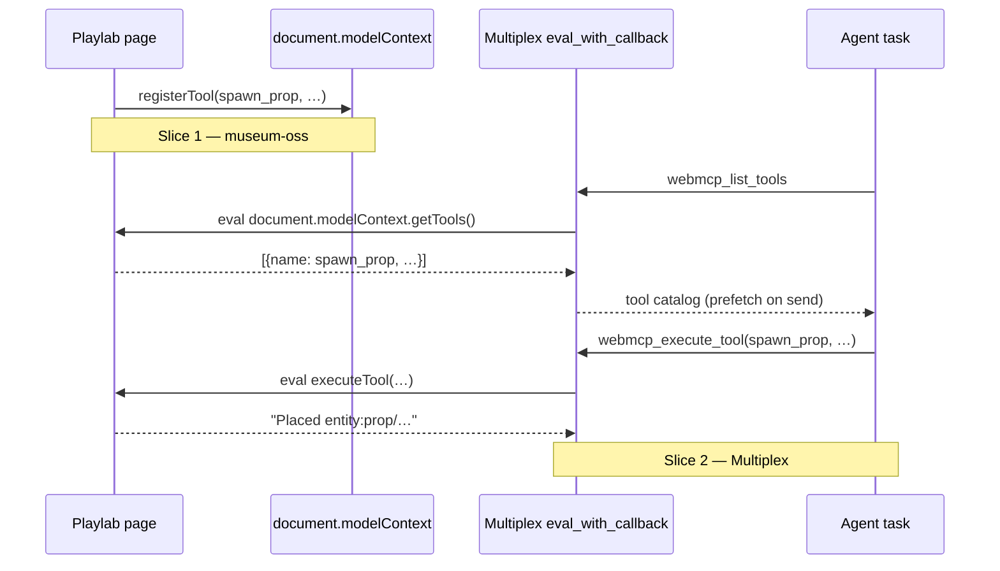

# TRL-218 — Spec: browser-to-agent WebMCP discovery bridge

Parent: [[issue:TRL-217]]

## Problem

Page registration (`document.modelContext.registerTool`) can succeed while the
agent task never receives `spawn_prop`. ChatGPT Site tools require:

1. Tools registered on the **top-level** page (not iframe)
2. Re-registration after navigation / HMR
3. Agent task **paired** with the built-in browser tab
4. Tools visible under **Site tools → Available site tools** (badge ≠ attached)

## Architecture



## Slice 1 — Playlab (museum-oss)

### 1.1 Idempotent re-registration

**Files:** `src/lib/engine/agent/webmcp/register.ts`, `src/lib/ui/WorldShell.svelte`

Refactor `registerWebMcpTools()`:

```ts
export type WebMcpRegistration = {
  supported: boolean;
  registered: string[];
  teardown: () => void;
};

let active: WebMcpRegistration | null = null;

export async function ensureWebMcpRegistered(): Promise<WebMcpRegistration> {
  active?.teardown();
  active = await registerWebMcpTools();
  return active;
}
```

`WorldShell.svelte`:

- Replace one-shot `webmcpRequested` gate with `ensureWebMcpRegistered()` whenever
  `world.status === 'ready'`.
- On HMR teardown (`onDestroy` + `isHmrTeardown()`): call `releaseWebMcp()` but
  **do not** skip re-register — the remount `$effect` must run again.
- After `rehydrateRuntimeAfterHmr()` when world stays ready: call
  `ensureWebMcpRegistered()` (dev-only path).

### 1.2 Origin trial (production)

**Files:** `src/app.html`, `vite.config.ts`, `.env.example`

```html
<!-- %sveltekit.head% or static slot -->
<meta http-equiv="origin-trial" content="%WEBMCP_ORIGIN_TRIAL_TOKEN%" />
```

Inject token at build from `VITE_WEBMCP_ORIGIN_TRIAL_TOKEN`. Omit meta when unset
(local dev uses `#enable-webmcp-testing`).

Target origin: `https://trellis-sync-3d-playground.vercel.app`

### 1.3 Docs

**File:** `docs/webmcp.md` — add **Site tools pairing (ChatGPT)** section:

- Enable **Settings → Browser → Permissions → Enable site tools**
- Reload Playlab; confirm `spawn_prop` under **Available site tools**
- Start/send agent request from task paired with that browser tab
- GPT-5.6 Sol / Terra only; Luna/Enterprise/Edu unsupported

### 1.4 Tests

- Existing: `e2e/webmcp-tools.spec.ts`, `pnpm webmcp:budget`
- New e2e: simulate soft reload / remount — `__webmcp.names()` still includes
  `spawn_prop` after `page.reload()` (with `installModelContext` re-applied in
  `beforeEach`).

## Slice 2 — Multiplex (external repo)

Contract only in this wedge; impl lands in Multiplex workspace.

### 2.1 Native bridge

`eval_with_callback(script, callback)` in paired WKWebView/Chromium pane:

```js
// list
JSON.stringify(await document.modelContext.getTools())

// execute
await document.modelContext.executeTool(
  { name: 'spawn_prop' },
  { mesh: 'primitive:box', position: [0, 1, 0] }
)
```

Expose as agent-callable tools:

| Tool | Input | Output |
| ---- | ----- | ------ |
| `webmcp_list_tools` | `{ origin?: string }` | JSON array of `{ name, description, inputSchema }` |
| `webmcp_execute_tool` | `{ name, arguments }` | string result / error |

### 2.2 Send-time prefetch

On agent `send`, if a browser tab is paired:

1. Call `webmcp_list_tools`
2. Append compact catalog to system context (names + one-line descriptions)
3. Register proxy tools for the turn (or route via `webmcp_execute_tool` only)

### 2.3 Composer Tools menu

When browser tab paired and catalog non-empty, list live page tools in Tools menu
(read-only preview; execution via bridge).

### 2.4 Platform limits (document)

| Runtime | WebMCP | Fallback |
| ------- | ------ | -------- |
| Chromium embedded (ChatGPT desktop) | `document.modelContext` when trial/flag on | — |
| WKWebView (macOS native shell) | May lack WebMCP | `webmcp.dev` relay or headless `pnpm agent:room` MCP |

Native smoke: console eval + `webmcp_list_tools` returns `spawn_prop` with Playlab
open on `?game=orbit`.

## Acceptance criteria

```
test:pnpm check
test:pnpm test:e2e e2e/webmcp-tools.spec.ts
test:pnpm webmcp:budget
Playlab: registerWebMcpTools re-runs after HMR soft reload and ?game= navigation
Playlab: app.html origin-trial meta via VITE_WEBMCP_ORIGIN_TRIAL_TOKEN
Playlab: docs/webmcp.md Site tools pairing checklist
Multiplex: eval_with_callback + webmcp_list_tools native smoke
Multiplex: prefetch + webmcp_execute_tool spawn_prop E2E
Multiplex: Tools menu + WKWebView limits doc
```

## Executor scope (this repo)

Implement **Slice 1 only** in museum-oss. Slice 2 is a follow-up impl issue in
Multiplex (block TRL-217 parent AC 1–3 until Multiplex lands).

## Files touched (Slice 1)

| File | Change |
| ---- | ------ |
| `src/lib/engine/agent/webmcp/register.ts` | `ensureWebMcpRegistered`, active teardown |
| `src/lib/ui/WorldShell.svelte` | Re-register on ready + HMR |
| `src/app.html` | Origin-trial meta placeholder |
| `vite.config.ts` | HTML transform for token |
| `docs/webmcp.md` | Pairing checklist |
| `e2e/webmcp-tools.spec.ts` | Reload persistence test |
