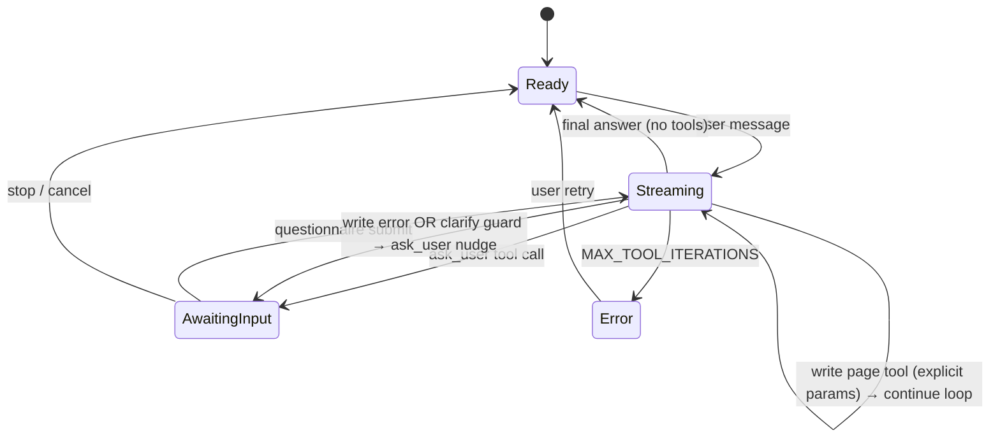
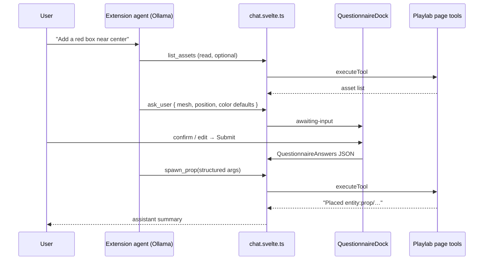

# TRL-230 — Spec: clarify-then-act for imperative WebMCP

Parent: [[issue:TRL-229]] · Proposal: [[issue:TRL-228]] · Epic: [[issue:TRL-217]]

Design: [`docs/artifacts/webmcp_clarify_then_act_design.md`](../../artifacts/webmcp_clarify_then_act_design.md)  
Mock: [`docs/artifacts/webmcp_clarify_then_act_mockup.html`](../../artifacts/webmcp_clarify_then_act_mockup.html)

**Primary impl repo:** `~/TURTLE/Projects/Extensions/WEBMCP/webmcp`  
**Cross-link only (museum-oss):** `docs/webmcp-tools.md`

## Problem

The extension agent can call imperative Playlab page tools (`spawn_prop`, `set_entity_field`, …) with guessed parameters or stall in thinking loops until `MAX_TOOL_ITERATIONS` (6). TRL-14 shipped `ask_user` + `QuestionnaireDock`, but prompt policy does not yet enforce **clarify-then-act** for ambiguous writes.

## Architecture





## Decision tree (authoritative)

From design artifact — Executor implements in prompt + optional guard:

| Condition | Action |
| --------- | ------ |
| Page tool has `readOnlyHint: true` | **Act** immediately |
| Write tool + all required params explicit in user message | **Act** (`spawn_prop` with literal mesh + position) |
| Write tool + missing/ambiguous required field | **Clarify** via `ask_user` (1–4 items, 1–2 typical) |
| Write tool returned `Error:` | **Clarify** single-item `ask_user` on failing field |
| User deferral ("surprise me") | **Act** with documented safe defaults |

**High-confidence act (no questionnaire):** literal schema values, single missing enum with one obvious choice, entity id taken from immediately prior read tool result.

**Must clarify:** unstated `mesh`, vague `position`, ambiguous `entityId`, unclear `set_entity_field` target, any required param after tool error.

## Slice — webmcp extension (v1)

### 1. Prompt policy

**Files:** `src/lib/ai/config.ts`, `src/lib/webmcp/toOllamaTools.ts`

Extend `CHAT_SYSTEM_PROMPT_BASE` (or `buildChatSystemPrompt` section when page tools present):

```text
Clarify-then-act for page WebMCP tools:
- Read-only tools (readOnlyHint): call immediately — never ask_user first.
- Write tools: infer from the user message; if any required parameter is missing or ambiguous, call ask_user with inferred defaults before the page tool. Never ask in prose.
- After a page tool Error, call ask_user to confirm the corrected field, then retry.
- Do not use extended thinking as a substitute for ask_user on ambiguous writes.
```

When building Ollama tools from discovered page tools, append to **write** tool descriptions:

```text
If required inputs are not explicit in the user message, call ask_user first with inferred defaults — do not guess.
```

Use `annotations.readOnlyHint` from page tool summary (already on `WebMcpToolSummary`).

### 2. `shouldClarifyBeforeWrite` heuristic

**New file:** `src/lib/webmcp/clarifyPolicy.ts`

```ts
export type ClarifyContext = {
  toolName: string;
  args: Record<string, unknown>;
  inputSchema?: Record<string, unknown>;
  readOnlyHint?: boolean;
  userText?: string;
};

export function shouldClarifyBeforeWrite(ctx: ClarifyContext): boolean;
```

**v1 rules (unit-tested):**

- `readOnlyHint === true` → `false`
- Missing any key in `inputSchema.required` and not inferable from `args` → `true`
- `spawn_prop`: `mesh` absent or not matching `primitive:*` / asset ref pattern when user did not cite one → `true`
- `spawn_prop`: `position` absent or non-numeric array → `true`
- Explicit literals in `userText` matching args → `false` for those fields

Export for tests; **do not hard-block** model calls in v1 — use for nudge only (§3).

**Tests:** `src/lib/webmcp/clarifyPolicy.test.ts`

### 3. Runtime loop guard (soft nudge)

**File:** `src/lib/chat.svelte.ts`

Track consecutive failed **page** tool calls (not builtin/browser/trellis) per turn:

```ts
let consecutiveWriteErrors = 0;
// on page tool result: ok → reset; error → increment
// if consecutiveWriteErrors >= 2 before next model call:
//   append synthetic tool-result to last failed tool:
//   "Clarify required: call ask_user with inferred defaults before retrying this write tool."
```

Alternative acceptable: inject nudge as extra `role: tool` system message before `runTurn` continuation.

**Do not** auto-call `ask_user` from runtime — model must still invoke it (prompt + nudge).

On `iteration >= MAX_TOOL_ITERATIONS`, existing error path unchanged.

### 4. UI (no new components v1)

Reuse TRL-14/20:

- `QuestionnaireDock.svelte` — canonical dock above composer
- `awaiting-input` disables composer (`ChatComposer.svelte` existing)
- Optional: first `ask_user` item `description` includes target tool name (`Before spawn_prop`)

A11y per design: focus first interactive in dock; composer out of tab order during await.

### 5. Documentation

| Location | Content |
| -------- | ------- |
| `webmcp/docs/help/clarify-then-act.md` (or existing Help section) | Decision tree + Playlab spawn example |
| `museum-oss/docs/webmcp-tools.md` | New § **Clarify-then-act** — 1 paragraph + link to extension Help |

### 6. E2E

**New file:** `e2e/clarify-then-act.spec.ts`

Fixture: static page registering mock `spawn_prop` (or Playlab dev URL with `?game=orbit` if stable in CI).

Flow:

1. Seed chat with ambiguous user message via test hook (or mock Ollama returning `ask_user` then `spawn_prop`)
2. Assert `QuestionnaireDock` visible before page tool executes
3. Submit questionnaire → assert mock page received structured `spawn_prop` args

Reuse `primeQuestionnaireForE2E` pattern from `chat.svelte.ts` for dock UI assertions; add integration path that exercises policy end-to-end when mock LLM available.

**Existing:** extend `e2e/questionnaire.spec.ts` only if shared helpers move — prefer new spec file.

## Out of scope (v1)

- JSON Schema → auto questionnaire generator (TRL-14 v2 / design v1.5)
- Playlab handler changes (museum-oss)
- Multiplex bridge (TRL-221)
- Hard runtime block preventing write tool call when `shouldClarifyBeforeWrite` is true

## Dependencies map

| File | Change |
| ---- | ------ |
| `webmcp/src/lib/ai/config.ts` | Clarify-then-act prompt section |
| `webmcp/src/lib/webmcp/toOllamaTools.ts` | Write-tool description preamble |
| `webmcp/src/lib/webmcp/clarifyPolicy.ts` | **New** heuristic + tests |
| `webmcp/src/lib/chat.svelte.ts` | Consecutive write-error counter + nudge |
| `webmcp/e2e/clarify-then-act.spec.ts` | **New** e2e |
| `museum-oss/docs/webmcp-tools.md` | Cross-link paragraph |

## Acceptance criteria

```text
test:pnpm check
test:pnpm test
test:pnpm test:e2e e2e/clarify-then-act.spec.ts
CHAT_SYSTEM_PROMPT includes clarify-then-act policy: read-only tools act immediately; ambiguous write tools must call ask_user before page tool
Page tool descriptions (buildAgentTools) append clarify preamble for non-readOnlyHint tools when Playlab tools present
shouldClarifyBeforeWrite heuristic exported and unit-tested: returns true when required spawn_prop fields missing from args
runTurn injects synthetic tool-result nudge after 2 consecutive failed write page-tool calls suggesting ask_user
Extension Help documents clarify-then-act with Playlab spawn_prop example
museum-oss docs/webmcp-tools.md § Clarify-then-act links extension policy
```

## Manual verify

1. Open Playlab `?game=orbit` with WebMCP extension on tab
2. Ask: *"Add a red box near the center"*
3. Agent calls `ask_user` (dock visible) — **not** prose clarify, **not** immediate `spawn_prop`
4. Submit → `spawn_prop` with confirmed mesh/position/color
5. Ask: *"Spawn primitive:box at 0,2,0"* → direct `spawn_prop`, no dock
