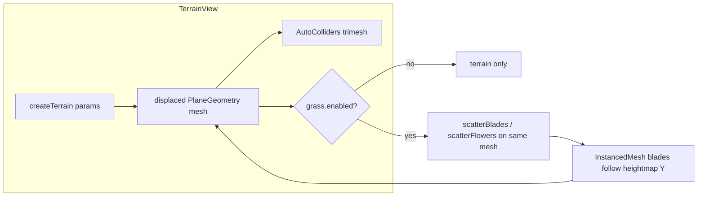
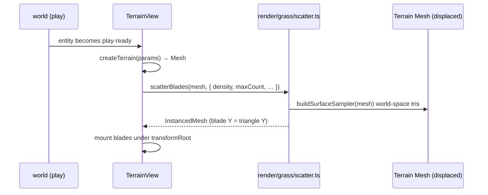

# TRL-234 — Spec: Terrain-owned grass (scatter onto heightmap)

Parent: [[issue:TRL-233]] · Proposal: [[issue:TRL-233]]

**Primary repo:** `~/TURTLE/Projects/Sandbox/museum-oss`

## Problem

The engine has two disjoint ground systems: `Terrain` (`render/terrain/terrain.ts`, a seeded
displaced heightmap with a matching trimesh collider) and `GrassField` (`render/grass/*`, a dense
instanced meadow scattered onto a **flat** plane). A world that wants hills (terrain) *and* grass has
to fake the latter on a flat plane that ignores the heightmap — the meadow sits on a plane, not the
terrain surface.

The grass surface-sampler already reads **world-space** vertices and places each blade at the
barycentric-interpolated point of a sampled triangle (`render/grass/scatter.ts:54` → `samplePoint`
`:94`), so blades follow *whatever* surface they scatter onto. The gap is purely wiring: a `GrassField`
cannot scatter onto another entity's mesh (its surface is a generated flat plane or a mesh *named*
`groundMesh` inside its own `.glb`).

## Approach

`Terrain` gains an **optional, default-off grass layer** that scatters onto its **own** displaced
mesh, reusing the vendored scatter + grass shader as-is. No cross-entity mesh plumbing, no new shader.





## Files (Executor deps)

| File | Change |
| ---- | ------ |
| `src/lib/engine/ontology/registry.ts` | `Terrain` component gains a `grass` field config |
| `src/lib/engine/render/views/TerrainView.svelte` | Scatter blades/flowers onto the terrain mesh when `grass.enabled`; reuse grass params/uniforms |
| `src/lib/engine/render/terrain/terrain.ts` | (optional) expose geometry/height accessors for sampling |
| `src/lib/engine/render/grass/scatter.ts` | **Unchanged** — reused as-is |
| `src/lib/engine/render/grass/grassField.ts` | **Unchanged** — reuse param resolve/materials |

**New primitives for Executor:** only new `Terrain.grass` schema fields + the scatter wiring in
`TerrainView`. No new behavior-system files.

## Design cautions (carry into impl)

- Terrain is 128 segments over 60u (≈0.47u cells) — density / `maxCount` need tuning so blades don't
  crawl on slopes; pick a sane default and expose curated fields.
- Slope-facing blades need normal-aware lean (`tilt`) so the field reads cleanly on hills, not vertical.
- Wind runs in play by default, frozen in edit, unless `stillInEdit: false` (mirror `GrassField`).
- **Additive / flag-off:** absence of `grass` must behave exactly as today; existing Terrain worlds
  unchanged.

## Acceptance criteria

```text
test:bash -lc "source ~/.nvm/nvm.sh && nvm use 22 >/dev/null 2>&1 && cd /Users/trentbrew/TURTLE/Projects/Sandbox/museum-oss && pnpm check"
test:bash -lc "cd /Users/trentbrew/TURTLE/Projects/Sandbox/museum-oss && test -f src/lib/engine/render/views/TerrainView.svelte && grep -q 'grass' src/lib/engine/ontology/registry.ts"
test:bash -lc "cd /Users/trentbrew/TURTLE/Projects/Sandbox/museum-oss && grep -q 'Terrain' src/lib/engine/render/views/TerrainView.svelte"
test:bash -lc "cd /Users/trentbrew/TURTLE/Projects/Sandbox/museum-oss && tsx --tsconfig .svelte-kit/tsconfig.json scripts/grass-terrain-smoke.ts"
```

Behavioral: `Terrain` with `grass.enabled` shows blades whose bases sit on the heightmap (a smoke
script asserts blade Y ≈ terrain sample Y within epsilon off-path); `grass` absent/disabled → no grass;
existing Terrain worlds unchanged.
