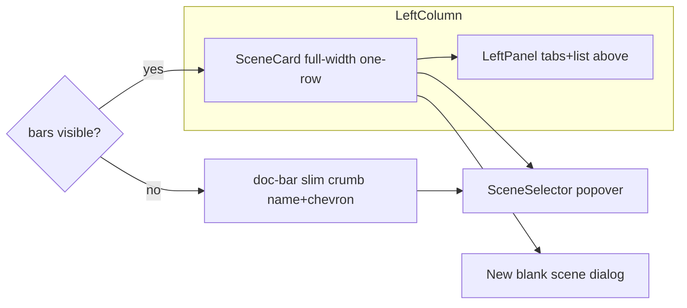

# TRL-241 — Spec: Scene selector card above left pane

Parent (design): [[issue:TRL-240]] · Proposal: [[issue:TRL-239]]
Design: [`docs/artifacts/scene_selector_card_design.md`](../../artifacts/scene_selector_card_design.md)
Mock: [`docs/artifacts/scene_selector_card_mockup.html`](../../artifacts/scene_selector_card_mockup.html)

**Repo:** `~/TURTLE/Projects/Sandbox/museum-oss`

## Problem

The scene is buried as a slim pill in the doc-bar breadcrumb (`DocBarBreadcrumb` → `SceneSelector
compact`), reading as nav chrome instead of "the document being edited." There's no always-visible
scene switcher when the left panel is collapsed beyond the breadcrumb text.

## Approach

Promote `SceneSelector` (non-`compact`) into a **full-width, one-row `SceneCard`** mounted above
`LeftPanel` inside the left column, **as a sibling of `.panel-shell`** (not nested). It drives the
existing `SceneSelector` popover (`Popover.Root`) + `newBlankScene`; scene title truncates; trailing
New-scene affordance. Dedup the doc bar: keep the slim `SceneSelector compact` crumb **only when
`sidebarsVisible === false`**. Adjust the left-panel top offset by the card height + gap; no
`--main-inset-*` / viewport-inset change (card is inside the already-inset column).



## Files (Executor deps)

| File | Change |
| ---- | ------ |
| `src/lib/ui/WorldShell.svelte` | Render `SceneCard` above `LeftPanel`; gate doc-bar crumb on `sidebarsVisible` |
| `src/lib/ui/SceneCard.svelte` | **New** — full-width card wrapping `SceneSelector` (non-compact) + New-scene |
| `src/lib/ui/DocBarBreadcrumb.svelte` | Keep slim `SceneSelector compact` crumb only when `sidebarsVisible === false` |
| `src/lib/ui/AppShell.svelte` | Add a `--left-panel-top-card` offset when card present (card height + gap) |
| `e2e/scene-selector-card.spec.ts` | **New** — card present when bars on; crumb when collapsed; card opens popover |

**Architect decisions encoded:** card is a sibling of `.panel-shell`; scene title truncates
(ellipsis); New-scene reuses `newBlankScene`; crumb is name+chevron only; same popover state.

## Acceptance criteria

```text
test:bash -lc "source ~/.nvm/nvm.sh && nvm use 22 >/dev/null 2>&1 && cd /Users/trentbrew/TURTLE/Projects/Sandbox/museum-oss && pnpm check"
test:bash -lc "cd /Users/trentbrew/TURTLE/Projects/Sandbox/museum-oss && grep -q 'SceneCard' src/lib/ui/WorldShell.svelte"
test:bash -lc "cd /Users/trentbrew/TURTLE/Projects/Sandbox/museum-oss && grep -q 'sidebarsVisible' src/lib/ui/WorldShell.svelte"
```

Behavioral (needs-e2e): sidebars on → card visible + left panel below; sidebars off → card hidden +
slim doc-bar crumb visible & clickable (opens the same popover); clicking card opens the popover.
