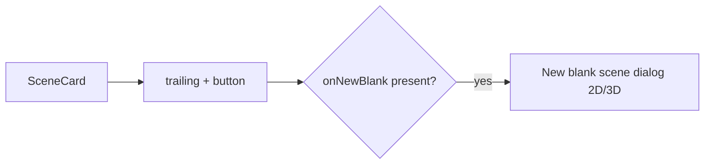

# TRL-244 — Spec: Trailing New-scene affordance on SceneCard

Parent: [[issue:TRL-243]] · Design: [[issue:TRL-240]] · Dependencies: [[issue:TRL-242]]

**Repo:** `~/TURTLE/Projects/Sandbox/museum-oss`

## Problem

The `scene_selector_card` design (TRL-240) shows a trailing **"+"** that opens the New blank scene
dialog directly. TRL-242 shipped the card without it (`SceneSelector.newBlankScene` is internal);
the reviewer accepted as a non-blocking deviation and flagged it as a clean follow-up.

## Approach

Expose SceneSelector's blank-scene trigger to SceneCard so a trailing `+` opens the **same** 2D/3D
`New blank scene` dialog.

- `SceneSelector`: add an optional `onNewBlank?: () => void` prop; `newBlankScene()` calls it (after
  closing the popover). Keep the internal dialog + options verbatim.
- `SceneCard`: render a trailing `+` button (`class="scene-card-new"`, `aria-label="New blank scene"`)
  that calls `onNewBlank`. Reuses the dialog; no duplicated state.

