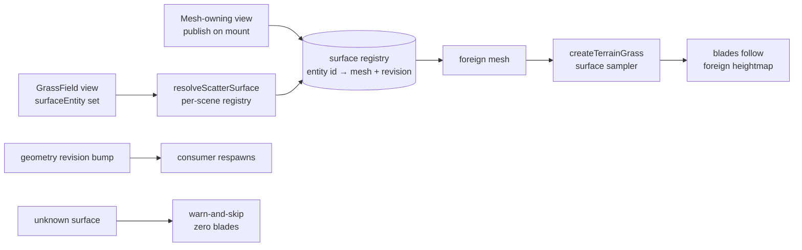

# TRL-253 — Spec: Cross-entity grass scatter surface

Parent proposal: TRL-251. Follow-on to TRL-234/235 (Terrain-owned grass).

## Problem

`createTerrainGrass` scatters onto the consumer's **own** mesh. A `GrassField`
(or any future consumer) cannot name another entity's mounted mesh as its
scatter surface, so grass cannot drape over independently authored geometry.

## Contract

1. **Ontology (additive):** `GrassField` gains optional `surfaceEntity: { t:
   'string', optional: true }` — an entity id naming the scatter surface.
   Absent → current behavior (own ground plane) unchanged.
2. **Lookup:** a view-level resolver, `resolveScatterSurface(entityId): Mesh |
   null`, backed by a per-scene registry that mesh-owning views publish into on
   mount and remove on unmount. Missing/unknown surface → warn-and-skip with
   zero blades (never crash, never block the frame).
3. **Scatter:** consumer passes the resolved mesh to `createTerrainGrass`
   (already surface-agnostic). Blade Y follows the foreign heightmap through
   the existing surface sampler.
4. **Rebuild triggers:** consumer respawns when its params change, when the
   referenced surface's geometry revision changes, or when the surface
   appears/disappears.
5. **Determinism:** same surface + same seed → same layout (seeded RNG
   already in `scatter.ts`).

## Notes for executor

- The sampler bakes in surface-local space (detached mesh, identity matrix —
  see `terrainGrass.ts` header). Under non-identity entity transforms the
  instances must still land on the surface (e.g. surface-local bake plus a
  consumer-relative mount, or equivalent) — do not assume identity transforms.
- The foreign mesh is sampled read-only: never repaint, remount, or dispose
  what the owning view owns.
- Reuse the `SvelteMap` pattern from `svelte/reactivity` (precedent:
  `player/gamepad.svelte.ts`) so registry reads stay reactive in `$derived`.

## Acceptance criteria

```text
test:bash -lc "source ~/.nvm/nvm.sh && nvm use 22 >/dev/null 2>&1 && cd /Users/trentbrew/TURTLE/Projects/Sandbox/museum-oss && pnpm check"
test:bash -lc "source ~/.nvm/nvm.sh && nvm use 22 >/dev/null 2>&1 && cd /Users/trentbrew/TURTLE/Projects/Sandbox/museum-oss && pnpm test:grass-surface"
test:bash -lc "cd /Users/trentbrew/TURTLE/Projects/Sandbox/museum-oss && grep -q 'surfaceEntity' src/lib/engine/ontology/registry.ts"
test:bash -lc "cd /Users/trentbrew/TURTLE/Projects/Sandbox/museum-oss && grep -rq 'resolveScatterSurface' src/lib/engine/render/grass/"
```

## Data flow


