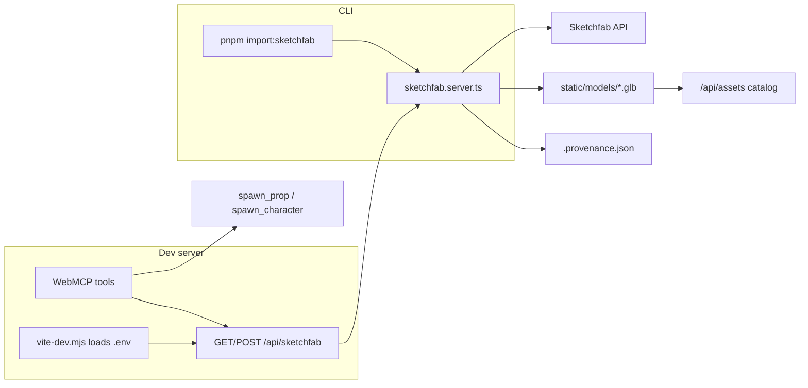

# sketchfab-harden — Spec: Sketchfab acquisition harden

Parent: strategist proposal `sketchfab-harden` (pathway C, pre-submission)

**Demo doc:** [sketchfab-acquisition.md](../../demo/sketchfab-acquisition.md)

## Problem

Sketchfab acquisition works when verified manually, but the wedge is uncommitted,
has no automated gates for the new WebMCP tools or dev-only API, and
`webmcp-surface-smoke` does not exercise `search_sketchfab` /
`import_sketchfab_model`. Submission demo needs green checks and graceful
key-missing behavior without live Sketchfab network in CI.

## Summary

Harden the shipped Sketchfab leg:

1. Unit/smoke tests for server helpers and configured-state checks (**no network**).
2. Headless WebMCP smoke steps for both Sketchfab tools (expect legible errors
   when `/api/sketchfab` is unavailable — normal in CI/headless).
3. Playwright e2e: manifest includes tools; mocked 503 returns actionable error.
4. `AGENTS.md` documents `pnpm import:sketchfab`, `.env`, and `vite-dev.mjs`.
5. Single commit of wedge source (exclude ad-hoc 50 MB demo GLBs).

## Architecture



Source: [visuals/sketchfab-flow.mmd](./visuals/sketchfab-flow.mmd).

### Layers (already impl — do not redesign)

| Layer | Path | Role |
| ----- | ---- | ---- |
| Server | `src/lib/sketchfab/sketchfab.server.ts` | Search, import, pack, provenance |
| CLI | `scripts/sketchfab-import.ts` | `--search`, `--import-first`, `--uid` |
| Dev API | `src/routes/api/sketchfab/+server.ts` | GET search, POST import (dev + key) |
| WebMCP | `handlers.ts` + `manifest.ts` | Agent-facing search/import |
| Env bootstrap | `scripts/vite-dev.mjs` | Load `.env` for Vite + server routes |

### Test seams (executor adds)

| Seam | File | Notes |
| ---- | ---- | ----- |
| Slug helper | `sketchfab.server.ts` | Export `slugifySketchfabName(s: string)` — pure, unit-testable |
| Config probe | `sketchfabConfigured()` | Already exported |
| Smoke | `scripts/sketchfab-smoke.mjs` | Node-only; no fetch to Sketchfab API |
| Headless tools | `scripts/webmcp-surface-smoke.ts` | Call both Sketchfab tools; assert `Error:` prefix + message mentions Sketchfab/dev/key |
| E2e | `e2e/webmcp-tools.spec.ts` | `page.route('**/api/sketchfab**', 503)` → `search_sketchfab` returns helpful error |

### Out of scope (defer)

- Sketchfab import → relay `trellis-blob:` upload
- Live Sketchfab network in CI
- Committing user demo imports under `static/models/` > 1 MB unless explicitly requested

## File checklist

| Path | Change |
| ---- | ------ |
| `src/lib/sketchfab/sketchfab.server.ts` | Export `slugifySketchfabName`; use internally |
| `scripts/sketchfab-smoke.mjs` | **New** — unit checks |
| `scripts/webmcp-surface-smoke.ts` | Exercise Sketchfab tools |
| `e2e/webmcp-tools.spec.ts` | Mocked 503 test |
| `package.json` | `"test:sketchfab": "node scripts/sketchfab-smoke.mjs"` |
| `AGENTS.md` | Run section: import + env |
| `docs/demo/sketchfab-acquisition.md` | Link smoke command in troubleshooting (optional one line) |

## Acceptance criteria

```text
test:pnpm check
test:pnpm webmcp:budget
test:pnpm test:sketchfab
test:pnpm test:webmcp-surface
test:PW_REUSE=1 pnpm test:e2e e2e/webmcp-tools.spec.ts
```

Behavioral:

- `slugifySketchfabName('Low Poly Tree!!!')` → `low-poly-tree` (max 48 chars).
- `sketchfabConfigured()` is false when `SKETCHFAB_API_KEY` unset in process env.
- `search_sketchfab` and `import_sketchfab_model` never throw; return `Error:` strings when API unreachable or 503.
- Git commit includes all wedge source files; does **not** include `static/models/low-poly-tree-scene-free.glb` unless human explicitly asks.

## Verification (reviewer)

```bash
pnpm check
pnpm webmcp:budget
pnpm test:sketchfab
pnpm test:webmcp-surface
PW_REUSE=1 pnpm test:e2e e2e/webmcp-tools.spec.ts
```
